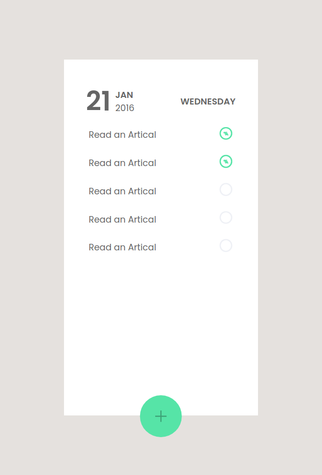

# To-do List Application in React - Part 2: Functional Specifications

This document outlines the functional specifications for a To-do List Application in React.

- Live Link: https://marvelous-belekoy-388f8b.netlify.app/

## Features
The To-do List Application should have the following features:

- A user should be able to click on the ``+`` button to add a new task to the list.
- The ``+`` button should be hidden when the user starts typing in the text input.
- If the user types something and presses ``enter``, a new item should be added to the end of the list.
- If the user types nothing and presses ``enter``, an error should be displayed asking them to ``enter`` something.
- If the user presses the ``Esc`` key, the text input should be hidden and the ``+`` button should be displayed again.
- The list should be scrollable, but the date and time should be sticky at the top of the list.
- The list items created on a day should be available all the time, for the same day, and should not get removed on reloading.
- If the user opens the list the next day, it should get reset with no items.

## Implementation
The To-do List Application can be implemented in React using the following components:

- A ``TodoList`` component that displays the list of tasks.
- A ``CheckedTodo`` component that represents a single task in the list that is completed.
- A ``UncheckTodo`` component that represents a single task in the list that is pending.

- I have used [React Icon](https://react-icons.github.io/react-icons) for Icons

## Folder Structure
    .
    ├── index.html
    ├── package.json
    ├── package-lock.json
    ├── public
    │   ├── snapshot-of-todo.png
    │   └── to-do-list.png
    ├── README.md
    ├── src
    │   ├── App.css
    │   ├── App.jsx
    │   ├── assets
    │   │   ├── checked.png
    │   │   ├── to-do-list-background.jpg
    │   │   └── unchecked.png
    │   ├── components
    │   │   ├── CheckedTodo.jsx
    │   │   ├── DisplayDate.jsx
    │   │   ├── DisplayDate.module.css
    │   │   ├── PlusButton.jsx
    │   │   ├── PlusButton.module.css
    │   │   ├── TodoList.jsx
    │   │   ├── TodoList.module.css
    │   │   └── UncheckTodo.jsx
    │   └── main.jsx
    └── vite.config.js

## How to use

- install node module ``npm install``
- run command ``npm run dev``
- now go to [http://localhost:5173/](http://localhost:5173/)

## SnapShot

